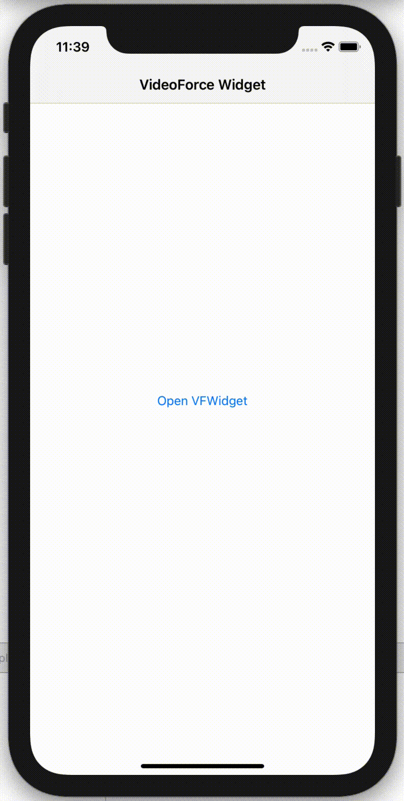

# VFWidget - Виджет VideoForce

[](https://travis-ci.org/m-keys/VFWidget)
[](https://cocoapods.org/pods/VFWidget)
[](https://cocoapods.org/pods/VFWidget)
[](https://cocoapods.org/pods/VFWidget)

## Пример



Чтобы запустить примерный проект, сначала клонируйте репозиторий и запустите `pod install` из каталога Example.

## Установка

Виджет доступен через [CocoaPods](https://cocoapods.org). Для установки добавьте следующую строку в Podfile:

```ruby
pod 'VFWidget'
```

Для вызова виджета внутри приложения используйте:

```swift
import VFWidget

var widgetVC = VFWidget()

@IBAction func openWidgetBtnAction(_ sender: UIButton) {
    widgetVC.model = VFWidgetModel(widgetId: "YOU-UUID-WIDGET")
    widgetVC.modalPresentationStyle = .pageSheet
    present(widgetVC, animated: true)
}
```

## Автор

VideoForce

## Лицензия

VFWidget доступен под лицензией MIT. Дополнительные сведения см. в файле LICENSE.

## Контакты

Вы можете связаться с нами через info@videoforce.ru
